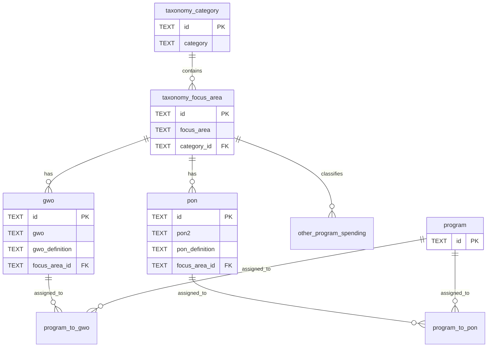
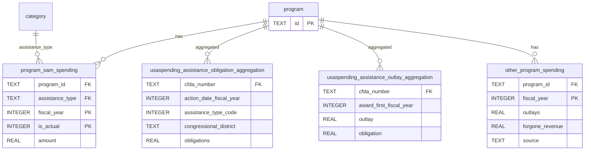
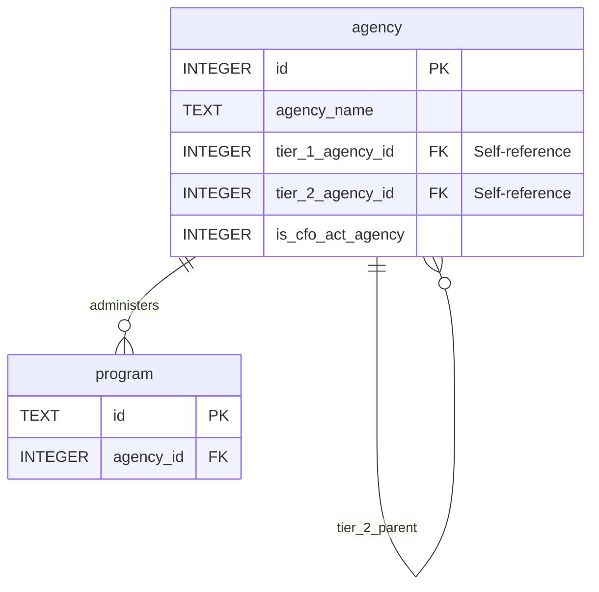

# Entity Relationship Diagram

This document provides a visual representation of the database schema for the OMB Federal Program Inventory (FPI) transformation database.

> **See also**: [Data Dictionary](DATA_DICTIONARY.md) for detailed table and column descriptions.

## Full Schema Diagram

```mermaid
erDiagram
    agency ||--o{ agency : "tier_1_agency_id"
    agency ||--o{ agency : "tier_2_agency_id"
    agency ||--o{ program : "has"
    
    category ||--o{ category : "parent_id"
    category ||--o{ program_sam_spending : "assistance_type"
    category ||--o{ program_to_category : "categorizes"
    
    program ||--o{ program_authorization : "has"
    program ||--o{ program_result : "has"
    program ||--o{ program_sam_spending : "has"
    program ||--o{ program_to_category : "belongs_to"
    program ||--o{ program_to_gwo : "assigned_to"
    program ||--o{ program_to_pon : "assigned_to"
    program ||--o{ usaspending_assistance_obligation_aggregation : "aggregated"
    program ||--o{ usaspending_assistance_outlay_aggregation : "aggregated"
    program ||--o{ other_program_spending : "has"
    program ||--o{ improper_payment_mapping : "mapped_to"
    
    taxonomy_category ||--o{ taxonomy_focus_area : "contains"
    
    taxonomy_focus_area ||--o{ gwo : "has"
    taxonomy_focus_area ||--o{ pon : "has"
    taxonomy_focus_area ||--o{ other_program_spending : "classified_by"
    
    gwo ||--o{ program_to_gwo : "assigned_to"
    
    pon ||--o{ program_to_pon : "assigned_to"
    
    agency {
        INTEGER id PK
        TEXT agency_name
        INTEGER tier_1_agency_id FK
        INTEGER tier_2_agency_id FK
        INTEGER is_cfo_act_agency
    }
    
    category {
        TEXT id PK
        TEXT type PK
        TEXT name
        TEXT parent_id FK
    }
    
    program {
        TEXT id PK
        INTEGER agency_id FK
        TEXT name
        TEXT popular_name
        TEXT objective
        TEXT sam_url
        TEXT usaspending_awards_hash
        TEXT usaspending_awards_url
        TEXT grants_url
        TEXT program_type
        BOOLEAN is_subpart_f
        TEXT rules_regulations
    }
    
    program_authorization {
        TEXT program_id FK
        TEXT text
        TEXT url
    }
    
    program_result {
        TEXT program_id FK
        INTEGER fiscal_year PK
        TEXT result
    }
    
    program_sam_spending {
        TEXT program_id FK
        TEXT assistance_type FK
        TEXT category_type FK
        INTEGER fiscal_year PK
        INTEGER is_actual PK
        REAL amount
    }
    
    program_to_category {
        TEXT program_id FK
        TEXT category_id FK
        TEXT category_type FK
    }
    
    taxonomy_category {
        TEXT id PK
        TEXT category
    }
    
    taxonomy_focus_area {
        TEXT id PK
        TEXT focus_area
        TEXT category_id FK
    }
    
    gwo {
        TEXT id PK
        TEXT gwo
        TEXT gwo_definition
        TEXT focus_area_id FK
    }
    
    pon {
        TEXT id PK
        TEXT pon2
        TEXT pon_definition
        TEXT focus_area_id FK
    }
    
    program_to_gwo {
        TEXT program_id FK
        TEXT gwo_id FK
    }
    
    program_to_pon {
        TEXT program_id FK
        TEXT pon_id FK
    }
    
    usaspending_assistance_obligation_aggregation {
        TEXT cfda_number FK
        INTEGER action_date_fiscal_year
        INTEGER assistance_type_code
        TEXT congressional_district
        REAL obligations
    }
    
    usaspending_assistance_outlay_aggregation {
        TEXT cfda_number FK
        INTEGER award_first_fiscal_year
        REAL outlay
        REAL obligation
    }
    
    other_program_spending {
        TEXT program_id FK
        INTEGER fiscal_year PK
        REAL outlays
        REAL forgone_revenue
        TEXT source
        TEXT focus_area_id FK
    }
    
    improper_payment_mapping {
        TEXT program_id FK
        TEXT improper_payment_program_name
        DECIMAL outlays
        DECIMAL improper_payment_amount
        DECIMAL insufficient_documentation_amount
        INTEGER high_priority_program
    }
```

## Taxonomy Classification Structure

## Financial Data Structure

## Agency Hierarchy Structure

## Legend

- **PK** = Primary Key
- **FK** = Foreign Key
- **||--o{** = One-to-Many relationship (one parent, many children)
- **||--||** = One-to-One relationship
- **}o--o{** = Many-to-Many relationship

## Relationship Types

### One-to-Many Relationships
- One `agency` can administer many `program`s
- One `program` can have many `program_authorization`s
- One `program` can have many `program_result`s (by fiscal year)
- One `program` can have many `program_sam_spending` records
- One `program` can belong to many `category`s (via `program_to_category`)
- One `program` can be assigned to many `gwo`s (via `program_to_gwo`)
- One `program` can be assigned to many `pon`s (via `program_to_pon`)
- One `taxonomy_category` can contain many `taxonomy_focus_area`s
- One `taxonomy_focus_area` can have many `gwo`s
- One `taxonomy_focus_area` can have many `pon`s

### Self-Referential Relationships
- `agency` can reference itself for tier 1 and tier 2 parent agencies
- `category` can reference itself for parent categories (hierarchical assistance types)

### Many-to-Many Relationships
- `program` ↔ `category` (via `program_to_category`)
- `program` ↔ `gwo` (via `program_to_gwo`)
- `program` ↔ `pon` (via `program_to_pon`)

## Notes

1. **Temporary Tables**: `usaspending_assistance` and `usaspending_contract` are not shown as they are temporary tables used during processing and deleted afterward.

2. **Views**: The `program_taxonomy_lookup` view is not shown as it's a derived view, not a physical table.